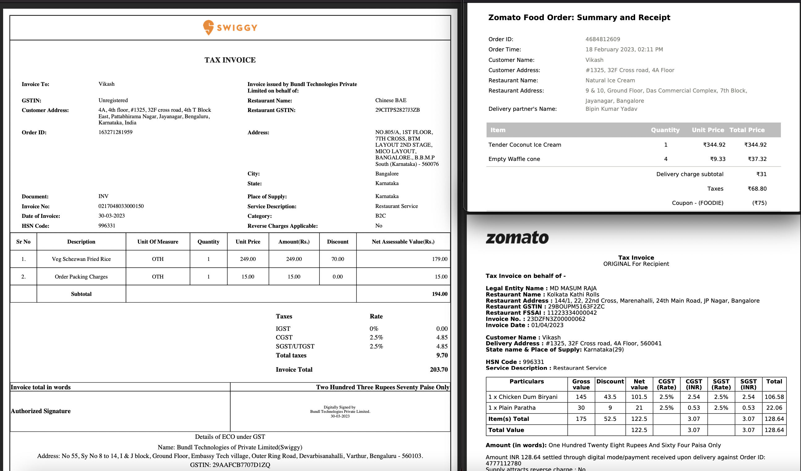
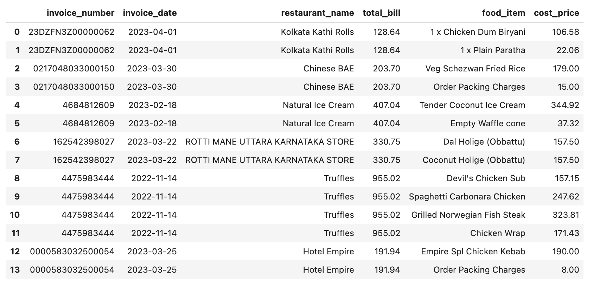
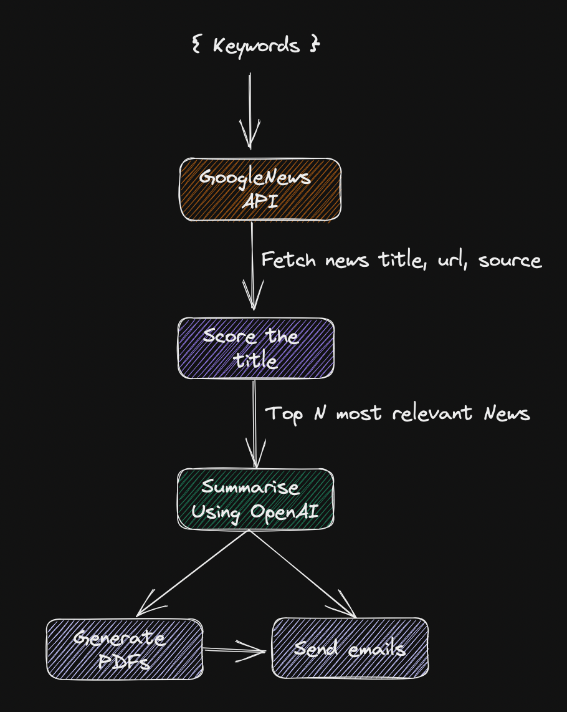

# Use cases/ Experimentation with ChatGPT
ChatGPT API Usage using - [Llamaindex](https://gpt-index.readthedocs.io/en/latest/index.html), [OpenAI](https://openai.com), [Guardrails](https://shreyar.github.io/guardrails/), [LangChain](https://python.langchain.com/en/latest/index.html) and more...

#
# 1. [Unstructured to Structured](./unstructuredToStructured/) ( pdfs invoices to pandas DataFrame)
### Source PDF files e.g.

### Target DataFrame e.g.

#
# 2. [NewsLetters](./newsLetter/)

Demo

Generic Work flow (WIP emails automation etc)

