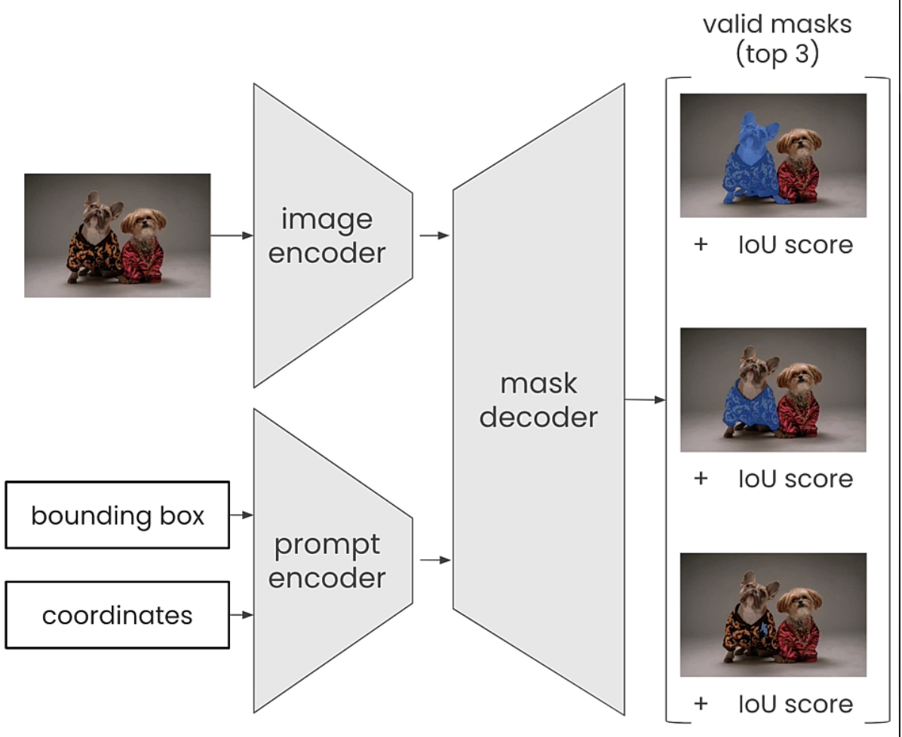
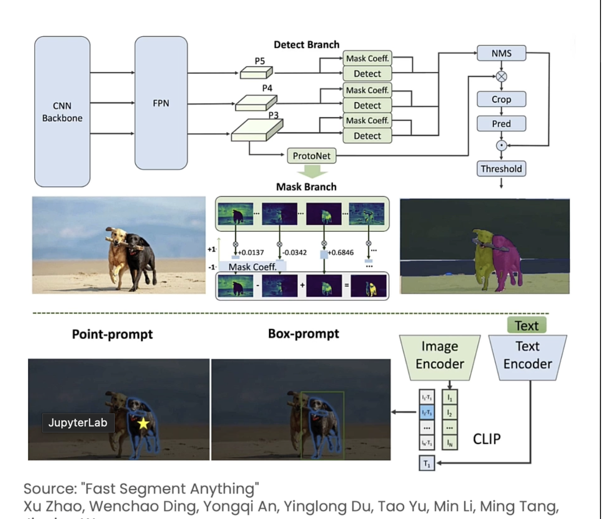
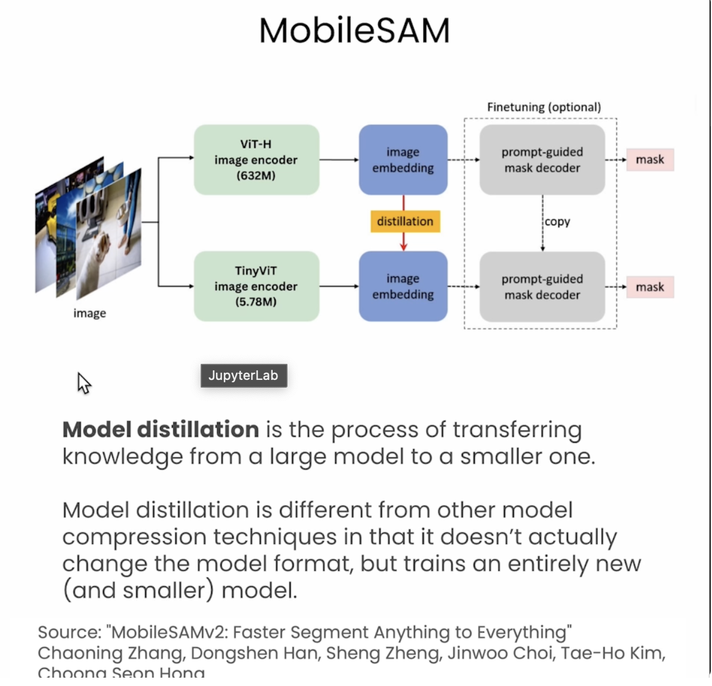
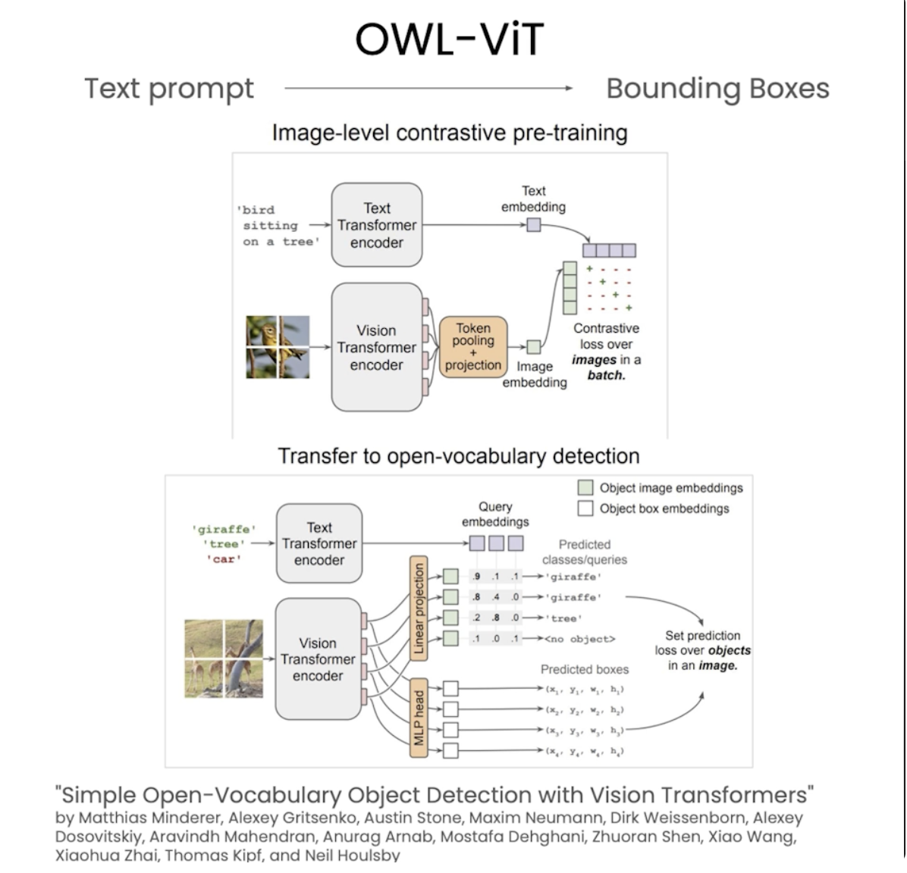
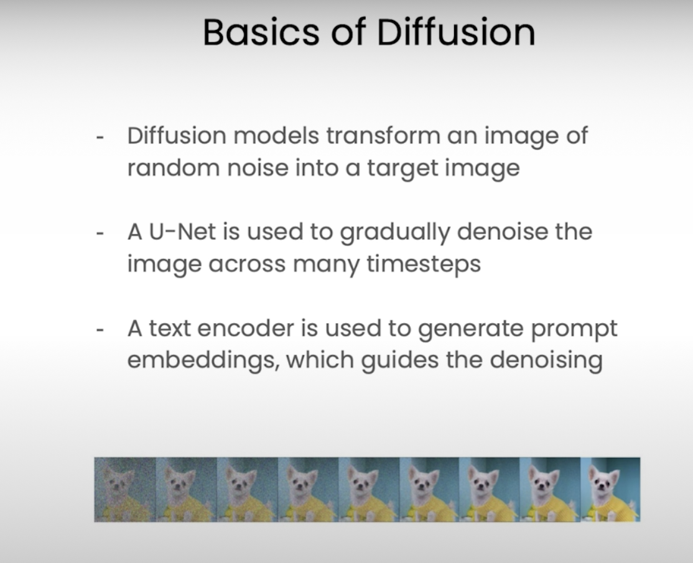
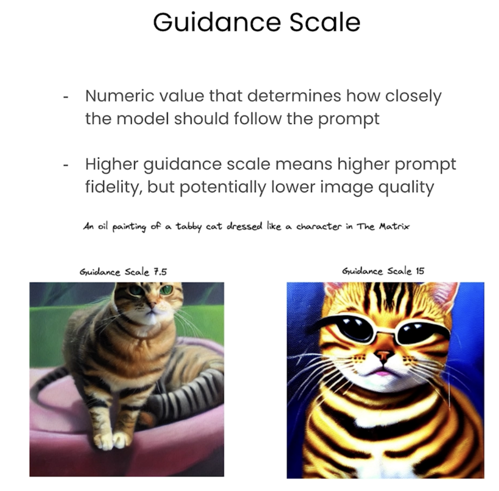

# L1 Overview
- Basic of Prompt Engg.
Prompt can be - Text, image, video , audio

### Image Segmentation
- Use of ```Segment Anything Model``` (SAM)
- Input pixel coordinates and bounding boxes as prompt

### Object Detection
- Use ```OWL-ViT``` and ```SAM``` to detect and segment existing objects within images using Natual Language

### Image Generation
- Use natural language to generate areas of image (subet of an image) which previously didn't exist.

### Fine-tuning
- Fine-tune image generation model using our custom images


Other References :
- Sharon Zhou - How diffusion model works


# L2 Image Segmentation 

Assigning labels to each pixel
- SAM (Segment Anything Model by Meta)
- FastSAM (50 times faster than SAM using 32x32 image size)

```pip install ultralytics torch```


### Type of Image Segmentations :
1. Semantic Image Segmentation
2. Instance Image Segmentation
3. Panoptic Image Segmentation





### MobileSAM




# L3 : Object Detection
ViT : Vision Transformers

### Text prompt --> To --> Bounding Box 

### Bounding Boxes --> To --> Segmentation

### Segmentation --> To --> Image Generation/ replacement/ Inpainting

Vision Transformer for Open-World Localization



# L4 : Image Generation

- Using diffusion models
- In-painting

What goes in?
- Text Prompt
- Image
- Mask image
- Hyperparameters




**Hyper Parameter**
Quality id influenced by -
1. ```No of Inferences``` : Higher the value more realistic and high resolution
2. ```Guidance Value``` : see image below
3. ```Strength``` : unique to image to imgae - how much noise to add and remove. May not need to tweak - need to be tested.
4. ```Negative prompt``` : Image to not look like, e.g. "cartoon"

Seed must be set to have reproducible results.



# L5 : Fine-tuning 

- Use of LoRA
- Use of Dreambooth trainer
