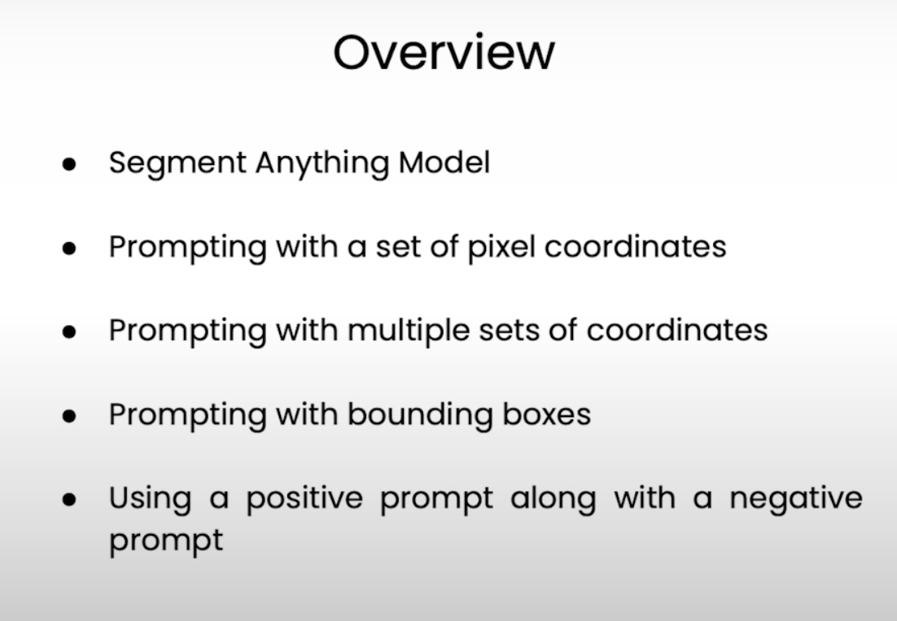

# L1 Overview

# L2 Image Segmentation 
Assigning labels to each pixel
- SAM (Segment Anything Model by Meta)
- FastSAM (50 times faster than SAM using 32x32 image size)

### Type of Image Segmentations :
1. Semantic Image Segmentation
2. Instance Image Segmentation
3. Panoptic Image Segmentation

### MobileSAM

# L3 : Object Detection
ViT : Vision Transformers

**Text prompt --> TO -> Bounding Box**

Vision Transformer for Open-World Localization

